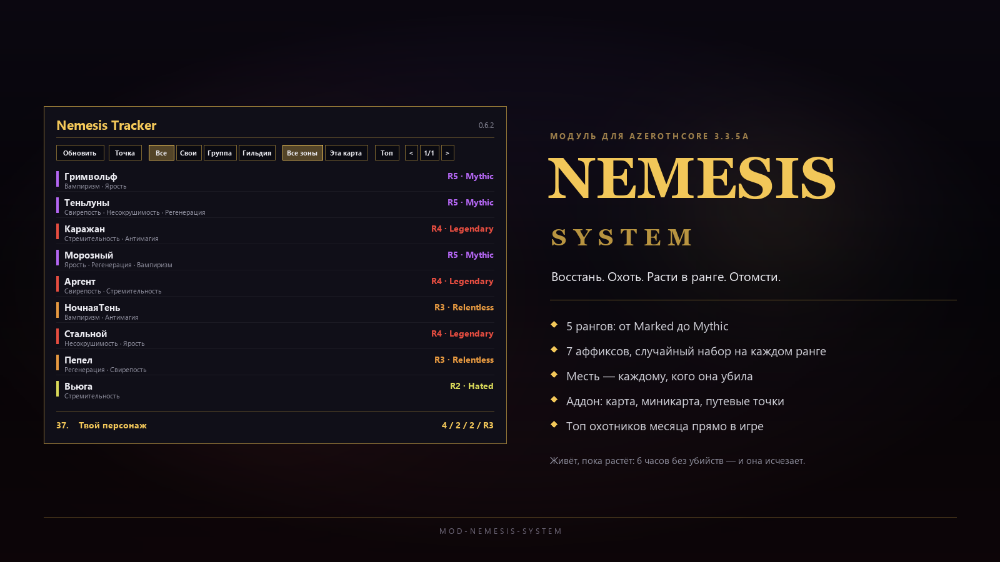

# Nemesis System Module

## Overview

`mod-nemesis-system` turns selected open-world PvE deaths into persistent revenge targets.
When an eligible creature kills a player, the creature is promoted into a Nemesis,
gains rank-based scaling, and is persisted in the characters database so the state
survives creature unloads and server restarts.

Optional City Siege integration can also promote active siege attackers and defenders
after they kill a real player. Because siege creatures are temporary summons, those
siege-created nemeses are runtime-only and are cleared when the creature dies or despawns.
The module now auto-detects City Siege support at compile time, so it can be built
and installed cleanly whether `mod-city-siege` is present or not.

This scaffold implements the first vertical slice:

- player-death trigger using `OnPlayerKilledByCreature`
- persistent `character_nemesis` storage in the characters database
- rank-based size, health, and melee/ranged damage scaling
- affix rolling with runtime behavior hooks
- configurable rank-based visual aura support for active nemeses
- re-application on `OnCreatureAddWorld`
- cleanup when a tracked nemesis dies
- decay for stale nemesis records
- direct revenge and bounty rewards on kill
- GM commands for testing and state control
- configurable announcements for creation, rank-up, and kill events
- anti-feed cooldowns for repeated promotions and same-victim farming
- initial companion addon transport and client scaffold for live nemesis tracking
- monthly kill leaderboard tracking for website or external dashboards
- configurable one-shot visual flash when a nemesis gains a rank
- affix descriptions generated from the live configuration, so the addon tooltips never drift from the server

## Files

- `src/NemesisSystem.cpp`: initial gameplay and persistence logic
- `src/nemesis_system_loader.cpp`: module loader entrypoint
- `conf/mod_nemesis_system.conf.dist`: module configuration
- `data/sql/db-characters/base/nemesis_system.sql`: characters database schema
- `doc/companion-addon-spec.md`: original companion addon design document, kept for reference; the contract that actually shipped is the `V2:*` family described under "Companion Addon" below
- `doc/discord-announcement.md`: ready-to-post player-facing announcement text plus the illustration brief
- `ClientAddon/NemesisTracker/`: WoW 3.3.5a addon scaffold

## Installation

1. Build AzerothCore with the module enabled.
2. Restart `worldserver`. AzerothCore applies the module's own SQL on startup: everything under `data/sql/db-*/base/` runs on a fresh install and everything under `data/sql/db-*/updates/` runs on an existing one, so nothing has to be imported by hand.
3. Copy `conf/mod_nemesis_system.conf.dist` to your server config directory if needed. The build only refreshes the `.dist`; the live `mod_nemesis_system.conf` is left alone so your edits survive. After an update, add any new keys to the live file yourself - a missing key logs a warning and silently falls back to the in-code default.
4. Copy `ClientAddon/NemesisTracker/` into the client's `Interface/AddOns/` directory, then `/reload`. Textures are cached in the client's VFS, so a change to an image file needs a full client restart instead.

## Current Behavior

- Nemeses only spawn from non-instance, non-battleground, non-raid kills.
- Only DB-backed creature spawns are eligible.
- Critters, pets, dungeon bosses, world bosses, and sanctuary deaths are excluded.
- Creature eligibility is configurable by absolute creature level, rank type, and player-versus-creature level windows.
- Initial ranks affect size, health, and weapon damage.
- Rank 1 rolls one affix. Rank 3+ rolls a second affix.
- Implemented affixes: `Vampiric`, `Swift`, `Juggernaut`, `Savage`, `Spellward`, `Enraged`, `Regenerating`.
- Rank 5+ rolls a third affix.
- Active nemeses also carry a configurable rank-based visual aura by default.
- `NemesisSystem.RankUpFlashVisual` plays a one-shot SpellVisualKit on the creature when it gains a rank. Preview ids with `.debug play visual <id>`; 0 disables it.
- The aura refresh is event-driven: it runs on world load, on rank change and when a creature leaves evade mode, instead of polling every creature on every tick.

Additional affix behavior:

- `Enraged`: gains bonus damage below a configurable health threshold.
- `Regenerating`: restores health periodically while damaged.
- Every player the nemesis kills is recorded as one of its victims; the most recent one is also stored as its current target.
- Base creature stats are persisted so scaling stays stable across restarts and reloads.

## Eligibility Config

- `NemesisSystem.MinCreatureLevel`
- `NemesisSystem.MaxCreatureLevel`
- `NemesisSystem.AllowNormal`
- `NemesisSystem.AllowElite`
- `NemesisSystem.AllowRare`
- `NemesisSystem.AllowRareElite`
- `NemesisSystem.AllowWorldBoss`
- `NemesisSystem.PromotionLevelDiffMax`
- `NemesisSystem.TrivialKillLevelDelta`
- `NemesisSystem.CitySiegeIntegration.Enable`
- `NemesisSystem.CitySiegeIntegration.Chance`
- `NemesisSystem.VisualAuraSpell`
- `NemesisSystem.VisualAuraSpellRank1`
- `NemesisSystem.VisualAuraSpellRank2`
- `NemesisSystem.VisualAuraSpellRank3`
- `NemesisSystem.VisualAuraSpellRank4`
- `NemesisSystem.VisualAuraSpellRank5`

Default visual ladder:

- Rank 1: shield visual level 1
- Rank 2: shield visual level 2
- Rank 3: shield visual level 3
- Rank 4: shield visual level 3 + static lightning visual
- Rank 5+: shield visual level 3 + Thaddius lightning visual

## Anti-Feed Config

- `NemesisSystem.RankUpCooldownSeconds`
- `NemesisSystem.SameVictimCooldownSeconds`

Anti-feed cooldown state is now persisted with each nemesis record, so cooldowns survive server restarts.

## Damage Scaling

- Base nemesis damage uses its own ladder, lower than the health ladder, so higher ranks lengthen fights instead of turning them into unavoidable one-shots.
- `NemesisSystem.MaxAffixDamageMultiplier` caps the combined `Savage` + `Enraged` bonus.
- `NemesisSystem.VampiricHealPct` controls how much a Vampiric nemesis heals from the damage it deals. Vampiric together with Regenerating is the strongest defensive pair, so it is tuned separately.
- `NemesisSystem.SwiftDamageMultiplier` compensates for the core's attack-speed scaling. Damage per swing is multiplied by `attackTime / 1000`, so swinging faster would otherwise leave damage per second unchanged and reduce Swift to a movement-speed affix. Set it to 1.0 to get that old behaviour back.
- Attack power is scaled together with weapon damage, so a rank gives the same effective multiplier whatever the mob's class. Previously the flat `attackPower / 14` term stayed at its base value, which made a warrior mob gain x1.82 and a caster almost x2.0.

## Health Scaling By Level

- `NemesisSystem.HealthScalingReferenceLevel` is the level at which the full health ladder applies. Below it the bonus is scaled towards 1.0, because base creature health grows far more slowly than player damage output across the levels.
- Without it a rank 5 nemesis of a level 40 mob is mathematically unbeatable solo: it needs roughly 330 player DPS while a levelling character deals about 120.
- At the reference level (default 80) nothing changes.
- Set it to 0 to always use the full multiplier.

## Decay

- `NemesisSystem.DecayHours` removes a nemesis that has stopped growing, measured from its creation or its last rank-up.
- A loaded grid or a passing player's sighting does **not** extend the timer, so nemeses do not become permanent fixtures in busy levelling zones.

## Rewards

- Revenge reward: granted to **every** player the nemesis has killed, or to a member of their party. Victims are stored in `character_nemesis_victims`, so the claim survives even after the nemesis moves on to another victim.
- Bounty reward: granted to other players who kill the nemesis.
- Rewards are configurable as direct item and gold grants.
- Item and gold rewards scale upward by nemesis rank.
- Rewards are granted to every eligible nearby party member, using AzerothCore's group reward distance.
- Reward scaling is based on the highest level among eligible nearby recipients.
- Overleveled kills scale rewards down linearly to zero.
- Underdog kills scale rewards up linearly to a configurable maximum multiplier.
- Gold and item rewards are scaled by the same level multiplier before being split across nearby recipients.

Announcement behavior:

- Create, rank-up, and kill announcements are sent to the nemesis creature's current zone.
- Rank-up announcements are promoted to server-wide only when a nemesis reaches rank 5.
- Announcement text includes nemesis location coordinates.

Reward scaling config:

- `NemesisSystem.RewardOverlevelDiffMax`
- `NemesisSystem.RewardUnderlevelDiffMax`
- `NemesisSystem.RewardUnderdogMaxMultiplier`
- `NemesisSystem.RevengeRewardGoldPerRankLevel`
- `NemesisSystem.BountyRewardGoldPerRankLevel`

## Website Leaderboard Data

- Monthly leaderboard rows are stored in `character_nemesis_monthly_kills` in the characters database.
- Rotation is automatic: each kill is written into a UTC month bucket using `YYYYMM` in `month_key`.
- The table stores total kills, revenge kills, bounty kills, highest rank killed, and the latest kill timestamp per character for the month.
- A simple website query can filter by the current month and sort by `kill_count DESC`, with `highest_rank_killed DESC` and `last_kill_at DESC` as tie-breakers.
- The same table feeds the addon's **Top** pane, which shows the current month's leaderboard in game. `NemesisSystem.LeaderboardMaxEntries` sets how many rows it returns (default 10).
- The pane always shows the requesting character as well: if they are inside the returned top their row is highlighted, otherwise their own standing (place, kills, revenge, bounty, best rank) is pinned to the bottom of the pane. A character with no kills this month still gets that line, marked as unranked.

## GM Commands

- `.nemesis debug`: inspect the selected creature
- `.nemesis info <spawnId>`: inspect a nemesis directly by spawn id
- `.nemesis mark [rank]`: create or set a nemesis on the selected creature
- `.nemesis reroll`: reroll affixes on the selected nemesis
- `.nemesis list`: list active nemeses on the current map
- `.nemesis clear`: clear the selected creature's nemesis state
- `.nemesis mapclear`: clear all active nemeses on the current map
- `.nemesis clearall`: clear all stored nemesis records
- `.nemesis reload`: reload module config

## Companion Addon

The module now includes an initial WoW 3.3.5a client addon scaffold under:

- `ClientAddon/NemesisTracker/`

Copy that folder into the game client's `Interface/AddOns/` directory.
The addon now embeds the Ace3 libraries it uses, so it no longer depends on a separately installed `Ace3` addon.
The addon version lives in `ClientAddon/NemesisTracker/NemesisTracker.toc` and is kept in step with the module CHANGELOG.

Current addon/server bridge behavior:

- `.nemesis addon bootstrap`: player-safe command that sends a filtered addon bootstrap containing recent, relation-matched, and rank 5 nemeses.
- `.nemesis addon report <spawnId>`: player-safe command used by the addon to submit a validated local sighting for a known nemesis.
  - A sighting is only accepted when the nemesis is loaded within `NemesisSystem.AddonReportMaxDistance` yards of the reporting player, and the stored position is read from the creature rather than from the client.
  - Reports are rate-limited by `NemesisSystem.AddonReportCooldownSeconds`.
- `.nemesis addon top`: player-safe command that returns the monthly leaderboard. The addon calls it automatically when the Top pane is opened.
- `.nemesis addon sync`: GM-only command that sends the full active nemesis snapshot for debugging.
- Server payload prefix: `Nemesis`
- Server payload families currently implemented:
  - `V2:HELLO`
  - `V2:BOOTSTRAP_BEGIN`
  - `V2:BOOTSTRAP_ENTRY`
  - `V2:BOOTSTRAP_END`
  - `V2:RANK5_BROADCAST`
  - `V2:UPSERT_VALIDATED`
  - `V2:REMOVE`
  - `V2:CHUNK`
  - `V2:AFFIX`
  - `V2:TOP_BEGIN`
  - `V2:TOP_ENTRY`
  - `V2:TOP_SELF`
  - `V2:TOP_END`

Current addon scaffold behavior:

- standalone movable tracker window with a fixed 860x520 layout; the control row and the map are laid out for exactly that box, so resizing is disabled and only the position is remembered
- live nemesis list with relation-aware sorting
- AceDB-backed local nemesis cache used as the addon's working dataset
- stale fading and hiding based on last-seen timestamps
- all controls (refresh, waypoint, relation filters, zone scopes, leaderboard toggle, pager) share one row above the map, and the list starts directly under that row
- per-row detail lives in the tooltip; there is no separate detail panel
- zone-aware map canvas that now attempts to load real WoW world map tile textures for mapped zones
- marker plotting for known nemesis last-seen locations using server-provided normalized coordinates
- filtered bootstrap ingest, chunk reassembly, peer sync, and validated upsert/remove handling
- waypoint hand-off to TomTom when it is installed (TomTom is not part of the client, so without it the coordinates are printed to chat)
- a Top pane with the current month's leaderboard, fed from `character_nemesis_monthly_kills`. The requesting character is always represented: inside the top their row is highlighted, otherwise their own standing is pinned to the bottom of the pane and marked unranked when they have no kills yet
- the Top button relabels itself to `Map` while the pane is open, so the same button opens the leaderboard and brings the map back
- row tooltips that list the nemesis affixes and explain what each one does. The wording comes from the server (`V2:AFFIX`), built from the live configuration, so tuning a value in the module config updates the tooltip automatically
- peer sync over addon comms for sharing validated sightings with guild, party, raid, or public channel scopes
- addon code split into dedicated modules for bootstrap, data/state, communication, lifecycle, and UI logic

Current addon location model:

- reaching rank 5 broadcasts a rounded last-known location realm-wide
- recent and relation-matched nemeses are restored via filtered bootstrap instead of full snapshot reloads
- lower-rank location refresh is driven by validated local sightings and addon-to-addon sharing
- promotion events now also emit live addon upserts for non-rank-5 nemeses so trackers populate faster
- local addon cache persists across sessions via AceDB and merges entries by timestamp

Current limitations:

- real map texture rendering depends on zone and texture mapping coverage; unmapped or unusual locations still fall back to the plain canvas
- public-channel peer sync still depends on players already being in the configured channel
- every map marker uses the same skull icon; rank is conveyed by marker colour and by the threat-coloured rank label in the list, not by the icon
- TomTom is not part of the client, so waypoints fall back to a chat message unless it is installed

Current addon file layout:

- `ClientAddon/NemesisTracker/Core.lua`: addon bootstrap and shared namespace/state setup
- `ClientAddon/NemesisTracker/Data.lua`: nemesis store, filtering, sorting, paging, and selection helpers
- `ClientAddon/NemesisTracker/Comm.lua`: server payload parsing, chunk reassembly, peer sync, and sighting reporting
- `ClientAddon/NemesisTracker/Lifecycle.lua`: AceDB initialization, slash commands, and event lifecycle wiring
- `ClientAddon/NemesisTracker/MapData.lua`: zone-to-texture lookup and map tile path resolution
- `ClientAddon/NemesisTracker/UI.lua`: tracker frame, list, map marker rendering, and the leaderboard pane
- `ClientAddon/NemesisTracker/Libs/`: embedded Ace3 runtime libraries required by the addon

## Next Steps

1. Add additional affixes and spell-driven visuals.
2. Add richer reward presentation and optional reward messaging.
3. Integrate with optional autobalance hooks.

## Branding Assets

`doc/assets/nemesis-discord-banner.png` is the 1600x900 announcement banner. Regenerate it with
`python .workbuddy-ai/tools/make_discord_banner.py doc/assets/nemesis-discord-banner.png`.
